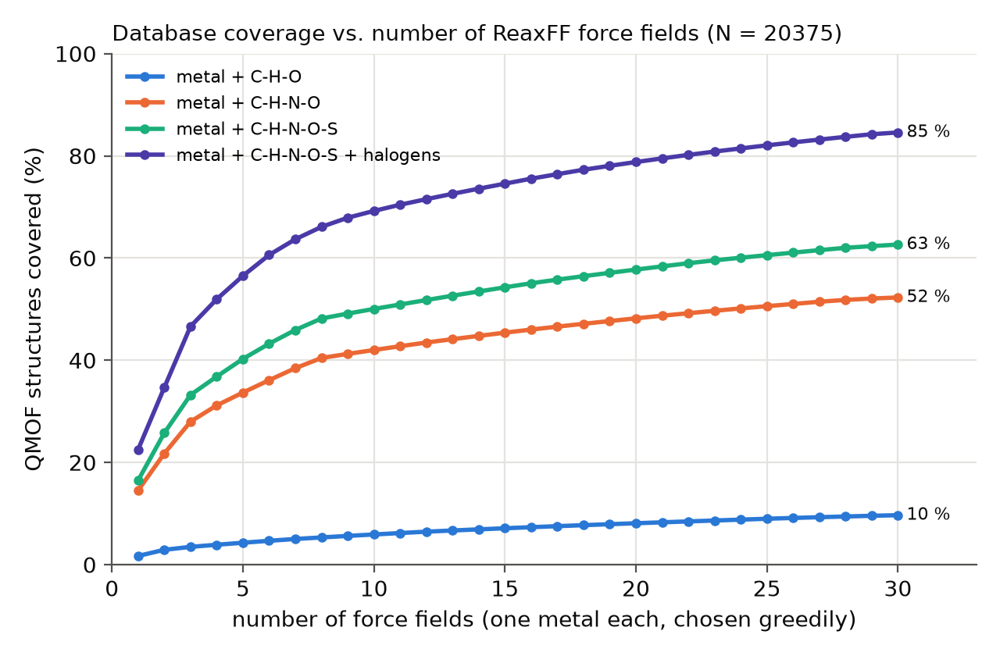

# ga-reaxff

[](https://github.com/ribeirojr-gh/ga-reaxff/actions/workflows/ci.yml)

**Genetic-algorithm parametrization of ReaxFF force fields, with LAMMPS as the evaluation engine.**

First test case: graphene oxide (C/H/O) with the Chenoweth–van Duin–Goddard (2008)
combustion force field, in a *synthetic recovery benchmark*: the force field
generates the reference data, 12 C–O parameters are perturbed by 10–20 %, and
the optimizer must recover a force field that reproduces the reference on a
held-out validation set. Next step: the same pipeline with DFT reference data.

## Pipeline

```
data/ffield.reax.cho ──► ffield.py (named parameter keys)
                           │
configs/*.toml ──► parameters.py (genome ∈ [0,1]^d, explicit bounds)
                           │
structures.py (GO model) ──► dataset.py (strain / scans / rattle families, extxyz)
                           │
                  engine.py (persistent LAMMPS instances, reaxff + QEq)
                           │
                  fitness.py (relative energies + forces, penalty, cache)
                           │
                  ga.py (LHS, tournament, SBX, polynomial mutation, elitism)
                           │  └─► local_refine (bounded Nelder–Mead)
                           │
                  audit.py (manifest, history.jsonl, result.json, ffield.best)
```

## Quick start

```bash
sudo apt-get install -y libmpich12          # MPI runtime needed by the LAMMPS wheel
pip install -e ".[dev,lammps]"
pytest -v                                   # 59 tests, ~30 s
ga-reaxff run configs/go_recovery.toml --out runs/go_recovery
ga-reaxff report runs/go_recovery
```

## Results of the GO recovery benchmark


See [`docs/results_go_recovery.md`](docs/results_go_recovery.md); the complete
run (manifest, per-generation history, final force field) is committed in
`runs/go_recovery/`.

## MOF database survey (stage 11)

Toward force fields for the ~20k MOFs of the QMOF database (Materials Project
MOF Explorer): MOFs are grouped by the chemistry a ReaxFF must describe, and
force fields are ranked by how much of the database they cover. Eight
metal + C/H/N/O force fields cover 40 % of the database; the pilot family is
Zn + C/H/N/O (2 958 MOFs, closed shell). See
[`docs/results_qmof_survey.md`](docs/results_qmof_survey.md).



```bash
pip install -e ".[dev,lammps,mof]"
python scripts/survey_qmof.py            # uses the committed, hash-verified snapshot
```

## Auditability

* **Branches**: every development stage lives on its own `feature/*` branch,
  merged into `develop` with `--no-ff` only after the tests passed; `main`
  holds the tagged releases (see [`CHANGELOG.md`](CHANGELOG.md)). Inspect with
  `git log --graph --oneline --all`. The rules are in
  [`CONTRIBUTING.md`](CONTRIBUTING.md).
* **Continuous integration**: every push and pull request runs the full suite
  on GitHub Actions; the `pytest -v` log and `pip freeze` of each run are kept
  as artifacts, and each stage also commits its own log. `main` and `develop`
  are protected (pull requests with a passing check only).
* **Where things run**: see [`CONTRIBUTING.md`](CONTRIBUTING.md#where-things-run).
* **Test logs**: the full `pytest -v` output of every stage is committed in
  `docs/test_logs/` together with the code it tested.
* **Development log**: [`docs/development_log.md`](docs/development_log.md)
  records every failure found by the tests and how it was resolved, including
  physics findings (graphene lattice constant of the force field, finite-difference
  force check, GA operator tuning).
* **Run provenance**: each run stores software versions, git commit, the
  SHA-256 of every input, the full configuration and seed.
* **Reference data integrity**: `data/ffield.reax.cho.sha256` is checked by the tests.

## Documentation

* [`docs/methodology.md`](docs/methodology.md) — objective, genome, training
  set design, optimizer, validation protocol, how to plug in DFT data.
* [`docs/development_log.md`](docs/development_log.md) — stage-by-stage audit trail.

## Repository layout

```
configs/            TOML run configurations
data/               reference force field, QMOF snapshot (+ provenance/hashes)
docs/               methodology, development log, results, test logs
runs/               committed benchmark run(s)
scripts/            figures, operator tuning, GitHub publishing helper
src/ga_reaxff/      package (one module per pipeline stage)
tests/              pytest suite (one file per stage)
.github/            CI (pytest on every push), PR/issue templates, CODEOWNERS
```

## Citation

To cite this software, see [`CITATION.cff`](CITATION.cff). Reference force field:


K. Chenoweth, A. C. T. van Duin, W. A. Goddard III, *J. Phys. Chem. A* **112**, 1040–1053 (2008).

## License

MIT
