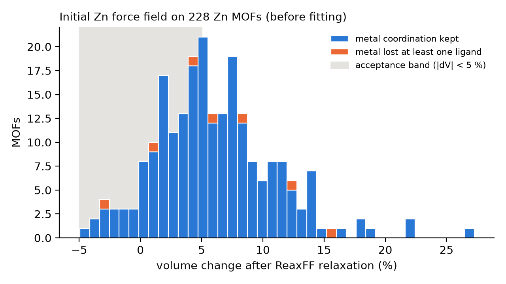

# Baseline: the initial Zn force field on 228 Zn MOFs

Stage 14. Goal: evaluate ReaxFF on real MOF structures (triclinic cells,
cell relaxation) and measure, MOF by MOF, how far the *initial* force field
is from DFT before any fitting. This is the reference the fit must beat and
the per-MOF validation machinery that every later force field goes through.

**Reproduce.** `python scripts/baseline_validation.py` (about 10 min on 12
CPU cores). Scorecards: [`baseline_validation/scorecards.jsonl`](baseline_validation/scorecards.jsonl);
every number below is in [`baseline_validation/summary.json`](baseline_validation/summary.json).
Relaxed structures are written to `runs/baseline_validation/` (not versioned).

## 1. What was needed to run ReaxFF on MOFs

1. **Triclinic cells.** 2 766 of the 2 958 Zn MOFs (94 %) are triclinic;
   the engine only accepted orthogonal boxes. Structures are now rotated
   into LAMMPS's restricted triclinic form and results rotated back. Tests:
   rigid rotation of a MOF gives the same energy and rotated forces; a
   sheared but equivalent cell basis gives identical energy and forces.
2. **Cell relaxation** (`fix box/relax`, all six components).
3. **Placeholder C-Zn and N-Zn entries.** The merged base of stage 12
   gives a finite energy but **NaN forces** on a Zn carboxylate MOF: a pair
   present in the structure without a bond entry breaks the LAMMPS ReaxFF
   force routine (an isolated Zn...CH4 pair does not, so the trigger is the
   bonded environment). `ffield.add_placeholder_pairs` copies the O-Zn
   entries to C-Zn and N-Zn as starting values; `single_point` now raises on
   non-finite results instead of returning NaN silently.

Initial force field: `data/ffields/init/ffield.Zn-FC.init` (FC + Zn from
ZnOH + placeholders).

## 2. Protocol

Sample: 228 MOFs with at most 150 atoms (200 drawn with seed 2027, plus the
30 MOFs of the teacher check; 2 overlap). Each MOF is relaxed from its QMOF
PBE-D3(BJ) structure (positions and cell, zero pressure, force tolerance
0.5 kcal/mol/A) and scored (`validate.compare`):

| criterion | threshold |
|---|---|
| volume change | abs(dV/V) < 5 % |
| atomic displacement (rms, rigid translation removed) | < 0.30 A |
| metal-ligand contacts (Zn-O, Zn-N within 2.6 A in DFT) | none lost |

## 3. Results

| | all | Zn-N bonded | Zn-O only |
|---|---|---|---|
| MOFs | 228 | 182 | 46 |
| passed | **96 (42 %)** | 94 (52 %) | 2 (4 %) |
| median volume change | +5.5 % | +4.7 % | +11.1 % |

No LAMMPS failure; median CPU time 4.7 s per MOF. Failures are almost all
volume expansion beyond 5 % (129 of 132, all expansions); 7 MOFs lose a Zn ligand; atomic
displacements stay small (median 0.04 A).

**Why the frameworks expand** - median change of the DFT bond lengths after
relaxation:

| bond | DFT median (A) | Zn-N bonded | Zn-O only | gas-phase screen (stage 12) |
|---|---|---|---|---|
| C-O (carboxylate) | 1.28 | **+6.2 %** | **+6.3 %** | CO2 C=O +8 % |
| N-H | 1.03 | +13.4 % | +14.2 % | NH3 N-H +13 % |
| Zn-O | 2.00-2.07 | +2.8 % | +4.0 % | donor terms fitted with other O parameters |
| O-H | 1.00 | +3.0 % | +3.3 % | H2O O-H +1 % |
| C-C | 1.42-1.43 | +1.7 % | +1.9 % | benzene C-C +1.4 % |
| C-N | 1.35-1.40 | +1.1 % | +2.7 % | |
| C-H | 1.09 | -2.1 % | -0.6 % | CH4 C-H -1.7 % |
| Zn-N (placeholder) | 2.06 | -1.8 % | - | |

The expansion is a bond-length problem, not a missing-dispersion problem:
the carboxylate C-O bonds, which hold every Zn-O-only framework together,
are 6 % too long, and Zn-O is 3-4 % too long. Zn-N, copied from Zn-O, is
slightly short, which is why N-containing frameworks expand less. The same
errors appeared in the isolated molecules of stage 12 (CO2, NH3), so the
molecular screen predicts the MOF behaviour.

## 4. Consequences for the fit

Priority of the parameters, now backed by data from 228 MOFs:

1. **C-O bond** (sigma and pi bond-order and energy terms): carboxylate
   geometry, and CO2 for the CCUS application.
2. **Zn-O** bond and off-diagonal terms, and the O-Zn-O / Zn-O-C angles.
3. **Zn-N** (placeholder today) and N-Zn-N / Zn-N-C angles.
4. **N-H** (amine and N-H...O groups; lower weight in the Zn family).

Targets for the fit: bond lengths and cell of the DFT structures (this
scorecard), plus energies and forces of off-equilibrium configurations from
the teacher/DFT (stage 13). The pass rate of this scorecard, 42 % now, is
the headline metric to track.
