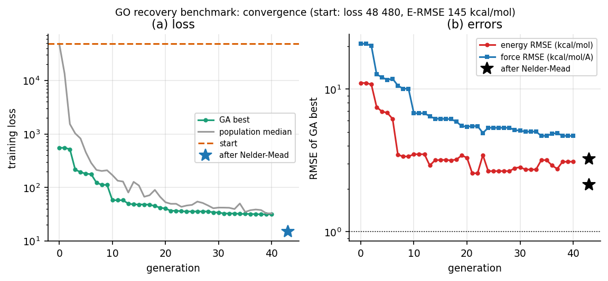
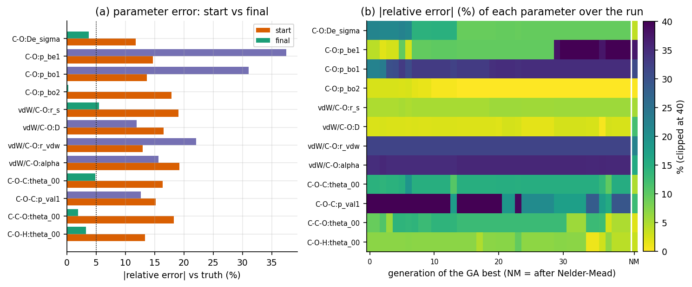
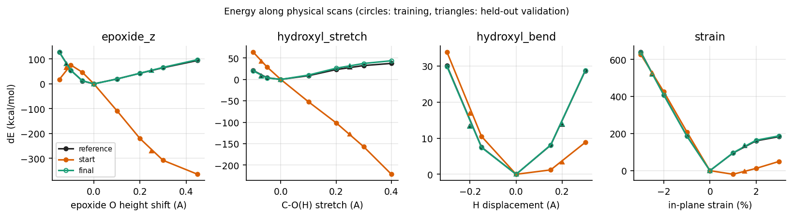
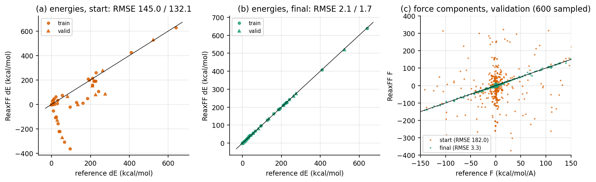

# Results: graphene-oxide recovery benchmark (v0.1.0)

Run: `ga-reaxff run configs/go_recovery.toml --out runs/go_recovery`
(complete outputs committed in `runs/go_recovery/`; code at commit `7d584f7`,
recorded in `manifest.json`; LAMMPS 22 Jul 2025; 1 CPU core; 625 s total).

## Figures
Generated by `python scripts/make_figures.py runs/go_recovery docs/figures`.

**Fig. 1** GA convergence: loss and RMSE of the best individual per generation; star = after Nelder-Mead.

**Fig. 2** Parameter recovery: (a) error vs truth, start and final; (b) error of every parameter over the run.

**Fig. 3** Energy along the physical scans (training: circles, validation: triangles).

**Fig. 4** Parity of relative energies (start, final) and of validation force components.

## Setup
* Reference: Chenoweth 2008 C/H/O force field. Model: C32O3H2 GO sheet at
  the force field's graphene lattice constant (a = 2.5023 A), relaxed.
* 36 training configurations (5 families) and 17 held-out validation
  configurations with different amplitudes and rattle seed.
* 12 C-O parameters perturbed by 10-20 % (seed 2026); bounds = start ±30 %
  (the truth lies inside the bounds: `truth_in_bounds = true`).
* GA: pop 40, 40 generations (1487 objective calls, 441 s), then bounded
  Nelder-Mead (400 iterations, 170 s). 4 of 2060 evaluations crashed LAMMPS
  and were penalized.

## Losses

| | loss | energy RMSE (kcal/mol) | force RMSE (kcal/mol/A) |
|---|---|---|---|
| train, start | 48 480 | 145.0 | 165.7 |
| train, after GA | 31.6 | - | - |
| train, after GA + Nelder-Mead | **14.97** | **2.13** | **3.23** |
| validation, start | 50 570 | 132.1 | 182.0 |
| validation, final | **13.82** | **1.67** | **3.32** |

Energy RMSE per family, start -> final (kcal/mol): strain 94.9 -> 2.58,
epoxide_z 252.9 -> 1.43, hydroxyl_stretch 144.1 -> 3.55,
hydroxyl_bend 10.8 -> 0.13, rattle 55.8 -> 1.18.

The validation loss improves as much as the training loss: **no overfitting**
to the training geometries.

## Parameters

| parameter | start | final | truth | start err % | final err % |
|---|---|---|---|---|---|
| bond:C-O:De_sigma | 141.56 | 154.44 | 160.48 | 11.8 | **3.8** |
| bond:C-O:p_be1 | -0.444 | -0.533 | -0.387 | 14.7 | 37.5 |
| bond:C-O:p_bo1 | -0.166 | -0.192 | -0.146 | 13.7 | 31.0 |
| bond:C-O:p_bo2 | 4.344 | 5.305 | 5.291 | 17.9 | **0.3** |
| offdiag:C-O:r_s | 1.521 | 1.347 | 1.278 | 19.1 | **5.5** |
| offdiag:C-O:D | 0.094 | 0.127 | 0.113 | 16.5 | 12.0 |
| offdiag:C-O:r_vdw | 1.612 | 1.444 | 1.852 | 13.0 | 22.1 |
| offdiag:C-O:alpha | 11.73 | 11.39 | 9.84 | 19.2 | 15.7 |
| angle:C-O-C:theta_00 | 86.57 | 70.77 | 74.40 | 16.4 | **4.9** |
| angle:C-O-C:p_val1 | 51.53 | 39.09 | 44.75 | 15.2 | 12.7 |
| angle:C-C-O:theta_00 | 58.60 | 50.50 | 49.56 | 18.3 | **1.9** |
| angle:C-O-H:theta_00 | 61.93 | 69.15 | 71.50 | 13.4 | **3.3** |

## Interpretation

1. **The machinery works end to end.** Errors fall by two orders of
   magnitude, on held-out data too, with every step logged and reproducible.
   A second run with the same seed reproduced the generation-by-generation
   values exactly (551.9 at generation 0, 194.3 at generation 4).
2. **The global optimum was not reached.** The true parameters give loss 0;
   the final loss is ~15. Nelder-Mead stopped at its iteration limit while
   still improving (31.6 -> 15.0), so the budget, not the method, is the
   immediate limit.
3. **Identifiability.** Six parameters return to within ~5 % of the truth
   (bond dissociation energy, the sigma bond-order exponent, sigma radius and
   the three equilibrium angles). The poorly recovered ones form known
   correlated groups: p_bo1/p_bo2 (same bond-order term), p_be1/De_sigma
   (same bond-energy term) and D/r_vdw/alpha (the van der Waals Morse term,
   weakly probed by near-equilibrium GO geometries). Several parameter
   combinations fit this training set almost equally well: the data, not
   only the optimizer, limit recovery.

## Next steps (in order of expected payoff)
1. Longer local refinement / restarted Nelder-Mead from the final point.
2. One-at-a-time sensitivity analysis and a parameter-correlation (Hessian)
   check to decide which parameters to fix.
3. Training data that separate the correlated groups: C-O dissociation
   curves to large distance (bond-order terms), O2/CO/H2O-on-graphene
   non-bonded scans (vdW term).
4. Multiple independent GA seeds (distribution of solutions) and a
   process-pool parallel objective.
5. Replace the synthetic reference by DFT (methodology.md, section 8).
