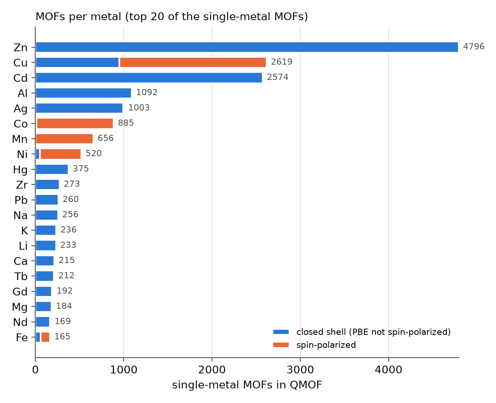

# QMOF survey: which ReaxFF force fields does the MOF database need?

Stage 11. Goal: turn "one ReaxFF per MOF for ~20k MOFs" into a tractable plan
by grouping MOFs by the chemistry a force field must describe.

**Data.** Materials Project MOF Explorer (MPContribs project `mofexplorer`,
built on the QMOF database, A. S. Rosen et al., *Matter* **4**, 1578 (2021)):
per-MOF metadata of 20 375 structures relaxed with PBE-D3(BJ). Snapshot in
`data/qmof/` (SHA-256 of the uncompressed JSON lines
`d29024dc5ff6692c4ee2e792efd6cbd707b5fc5eee1e2dece56a19dae06fd387`,
retrieved 2026-09-25; source and units in `provenance.json`). Structures were
not downloaded in this stage.

**Reproduce.** `python scripts/survey_qmof.py` (uses and verifies the committed
snapshot; `--fetch` downloads a new one). Every number below is in
`docs/qmof_survey/summary.json`; the outputs are byte-identical across runs
and hash seeds.

## 1. Why one force field per MOF is the wrong unit

ReaxFF parameters are attached to elements and element pairs/triplets, not to
structures. A force field with element set *E* describes every MOF whose
elements are a subset of *E*. Fitting one force field per MOF would produce
20k mutually inconsistent parameter sets for the same chemistry, and each
would be trained on a single structure (overfitting). The unit used here is
the **chemical family** (metal set + non-metal set); every MOF still gets its
own validation (planned for later stages).

## 2. Composition of the database

| | count |
|---|---|
| structures | 20 375 |
| single-metal | 19 005 (93.3 %) |
| two metals / three metals / metal-free | 1 335 / 16 / 19 |
| distinct metals (single-metal MOFs) | 59 |
| spin-polarized at PBE level | 4 417 (21.7 %) |
| experimentally synthesized (CSD, CoRE, ...) | 16 884 (82.9 %) |
| atoms per cell, median (p10-p90, max) | 96 (50-200, 500) |
| MOFid node decomposition missing | 2 695 |

Non-metals: C in every structure, H 99.8 %, O 85 %, N 80 %, S 16 %, Cl 11 %,
F 6 %, Br 5 %, I 4 %, P 4 %.

Per-metal table (single-metal MOFs): [`qmof_survey/metals.md`](qmof_survey/metals.md).

## 3. Coverage: how many force fields are needed

Each candidate force field is one metal plus a fixed non-metal base; the
candidates are picked greedily by how many not-yet-covered MOFs they unlock.

| non-metal base | 1 FF | 5 FF | 10 FF | 30 FF |
|---|---|---|---|---|
| C-H-O | 1.7 % | 4.3 % | 5.9 % | 9.7 % |
| C-H-N-O | 14.5 % | 33.7 % | 42.0 % | 52.3 % |
| C-H-N-O-S | 16.5 % | 40.3 % | 50.0 % | 62.6 % |
| C-H-N-O-S + F, Cl, Br, I | 22.5 % | 56.5 % | 69.2 % | 84.6 % |

Tables of the picks: [`qmof_survey/coverage.md`](qmof_survey/coverage.md).

**Findings.**
1. **N is essential.** A C/H/O organic base covers under 10 % of the database
   even with 30 force fields; adding N multiplies coverage by ~5.
2. **The distribution is steep.** With a C/H/N/O base, eight force fields
   (Zn, Cd, Cu, Co, Al, Ag, Mn, Ni) cover 8 240 structures (40 %); the next
   22 add only 12 %.
3. **Halogens and S are the next lever.** Extending the organic base with S
   and halogens raises the 10-force-field coverage from 42 % to 69 %. They
   usually sit on linkers or as counter-ions, so they belong to the shared
   organic part rather than to each metal family.
4. **Spin is a physical boundary for ReaxFF.** Co (99 %), Mn (100 %), Ni
   (90 %), Cu (64 %) and Fe (63 %) MOFs are mostly spin-polarized at the PBE
   level. ReaxFF has no explicit spin, so these families are expected to be
   harder and are scheduled after the closed-shell ones.
5. **Hypothetical vs. synthesized.** Al and Zr MOFs are 97 % hypothetical
   (generated structures), Zn 41 %. Validation statistics should be reported
   separately for synthesized structures.

## 4. Pilot family

| family | MOFs (metal + C/H/N/O only) | spin-polarized | synthesized | median / p90 atoms |
|---|---|---|---|---|
| **Zn + C-H-N-O** | **2 958** | **0 %** | 68 % | 116 / 232 |
| Cd + C-H-N-O | 1 473 | 0 % | 100 % | 98 / 206 |
| Cu + C-H-N-O | 1 271 | 64 % | 96 % | 84 / 183 |
| Al + C-H-N-O | 512 | 0 % | 3 % | 86 / 182 |

**Recommendation: Zn + C/H/N/O.** It is the largest family (14.5 % of QMOF on
its own), closed-shell (Zn(II) is d10, no spin problem), 2 010 of its
structures are synthesized, and it spans several net topologies (MOFid:
pcu 870, sql 276, dia 104, hcb 71, bcu 59, nbo 57; 1 122 without an assigned
topology), including 72 MOF-5-type structures (Haranczyk set). Zn-N
imidazolate (ZIF-like) frameworks are present but few in this family by a
simple linker heuristic (27); the QMOF MOF-74 set contains only Mg. Cd +
C/H/N/O is the natural second family: same d10 chemistry, entirely
synthesized structures.

## 5. Next stages

1. **Base force field for Zn/C/H/N/O**: survey published ReaxFF parameter sets
   for the organic part (C/H/N/O) and for Zn-O/Zn-N; extend `ffield.py` to
   merge element blocks; define which cross terms the GA optimizes.
2. **Structures and reference data**: download the Zn family structures (DFT
   relaxed geometries, DDEC6 charges) and test a universal machine-learning
   potential as the reference "teacher" against the QMOF DFT data (forces at
   the relaxed geometries should be ~0, cells should stay put).
3. **Fit and per-MOF validation** on the Zn family, then scale to the next
   families in the order of section 3.
