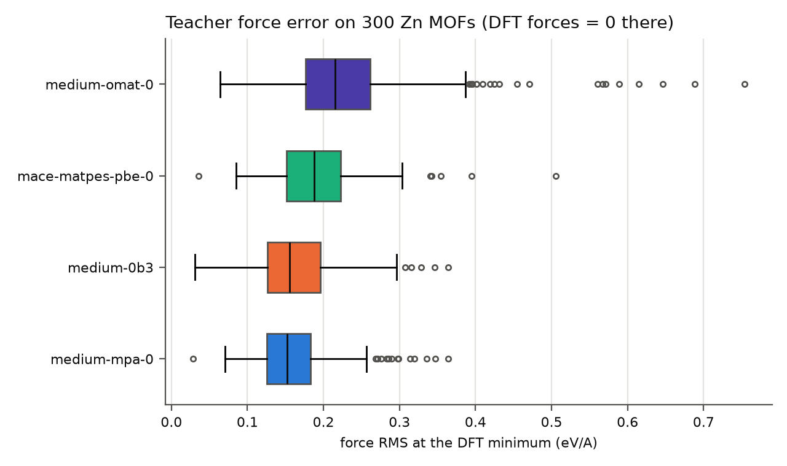
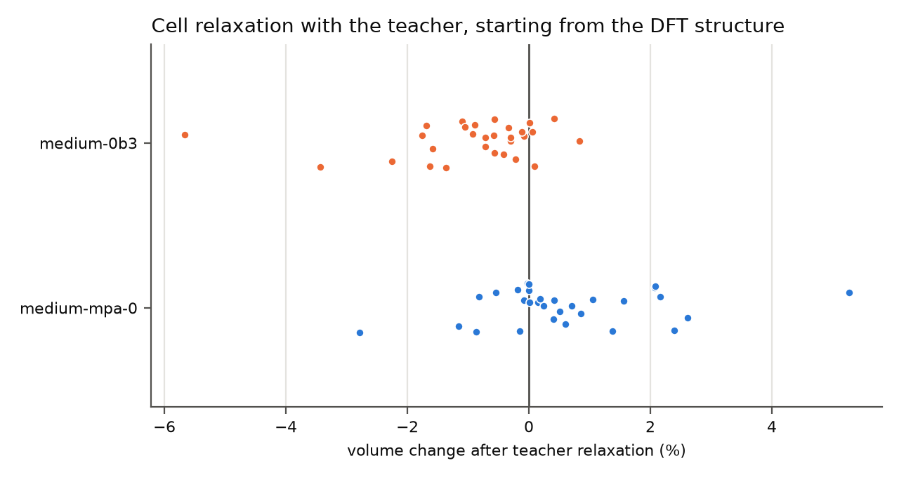

# Structures of the Zn family and the machine-learning teacher

Stage 13. Goals: (1) download the DFT-relaxed structures of the pilot family;
(2) decide whether a universal machine-learning interatomic potential (MLIP)
can label the off-equilibrium configurations a ReaxFF fit needs.

## 1. Structures

The 2 958 MOFs of the Zn + C/H/N/O family (404 185 atoms) were downloaded
from the MOF Explorer (MPContribs `mofexplorer`, QMOF, PBE-D3(BJ) relaxed):
`data/qmof/structures_Zn-CHNO.extxyz.gz` (11 MB, SHA-256 of the uncompressed
extxyz `9c0d0171...2685`, provenance in `structures_Zn-CHNO.provenance.json`).
Each structure carries, per atom, the PBE **DDEC6 and CM5 charges**, the
**DDEC6 bond-order sums** and magnetic moments, and the PBE-D3(BJ),
PBE and D3 energies. All structures are charge neutral in DDEC6. The
charges and bond orders are direct targets for ReaxFF's QEq charges and
bond orders, which few ReaxFF training sets have.

## 2. Teacher check

**Reproduce.** `python scripts/teacher_check.py` on the local GPU
(RTX 4070 8 GB; about 3 h, dominated by the float64 relaxations). All numbers
below are in [`teacher_check/summary.json`](teacher_check/summary.json);
per-structure records in `teacher_check/*.jsonl`.

At the QMOF geometries the DFT forces are (close to) zero, so a teacher's
forces there are its force error. Four MACE foundation models, each with
D3(BJ) dispersion for PBE (as in QMOF), on a random sample of 300 MOFs
(seed 2026):

| model | force RMS, median (p90) eV/A | by element: C / N / O / H / Zn | energy spread after per-element offsets (MAE, meV/atom) | median pressure at DFT cell (GPa) |
|---|---|---|---|---|
| **medium-mpa-0** | **0.152** (0.221) | 0.185 / 0.195 / 0.121 / 0.062 / 0.116 | 13.3 | +0.04 |
| medium-0b3 | 0.155 (0.248) | 0.187 / 0.245 / 0.126 / 0.053 / 0.104 | 14.5 | -0.19 |
| mace-matpes-pbe-0 | 0.187 (0.253) | 0.230 / 0.222 / 0.141 / 0.070 / 0.129 | 14.1 | +0.03 |
| medium-omat-0 | 0.215 (0.336) | 0.264 / 0.267 / 0.158 / 0.090 / 0.112 | 13.4 | -0.23 |

Cell and position relaxation from the DFT structure, 30 MOFs with at most
150 atoms, the two best models (FIRE, fmax 0.02 eV/A, 500 steps):

| model | converged | abs volume change, median (max) | max lattice-length change, median | atomic displacement rms, median |
|---|---|---|---|---|
| medium-mpa-0 | 15/30 | 0.65 % (5.3 %) | 0.65 % | 0.15 A |
| medium-0b3 | 20/30 | 0.72 % (5.7 %) | 0.46 % | 0.11 A |

For comparison, the initial ReaxFF on the same 30 MOFs (stage 14):
median abs volume change 6.0 %.

## 3. Findings

1. **Cells and energies are good; forces are not good enough to be a
   reference on their own.** The best teacher keeps MOF volumes within 1 %
   of DFT (ten times better than the initial ReaxFF) and reproduces energy
   differences between MOFs to 13 meV/atom, but its forces at the DFT minima
   are 0.15 eV/A rms. That is the accuracy expected of a *good* fitted
   ReaxFF, so fitting ReaxFF to teacher forces alone would bake the
   teacher's error into it.
2. **The error sits in the organic linkers, not in Zn.** C and N forces are
   the worst (0.19-0.27 eV/A), H the best (0.05-0.09), Zn and O in between.
   Universal potentials are trained mostly on inorganic crystals, and MOF
   linkers are molecular.
3. **Model choice.** medium-mpa-0 has the lowest force error and energy
   spread; medium-0b3 is close and converges relaxations more often. The
   OMat-trained model is the worst here.
4. **Practical notes.** One 500-atom MOF did not fit in 8 GB of GPU memory
   in float64 with D3 at first; `expandable_segments` in the PyTorch
   allocator removed the problem (a CPU fallback is in place and was not
   needed in the final run). The shell sets `OMP_NUM_THREADS=1`, so the
   CPU fallback sets its own thread count. Licences: the MatPES and OMat
   models print licence terms on loading; check them before any
   distribution of derived data.

## 4. Decision for the reference data

Use the teacher where it is reliable and DFT where it is not:

- **Teacher (medium-mpa-0)**: first labels for configurations far from
  equilibrium (strains, scans, rattled structures, adsorbates), where
  energy differences are large compared with its 13 meV/atom error, and for
  pre-screening which configurations deserve DFT.
- **QMOF DFT**: equilibrium geometries, cells, DDEC6 charges and bond orders
  of all 2 958 MOFs (exact anchor, no extra cost).
- **Own DFT (PBE-D3(BJ), same settings as QMOF)** on a small, selected set:
  (i) to fine-tune the teacher on MOF linkers (the error is concentrated in
  C and N, so a few hundred labelled configurations of this family should
  help), and (ii) for the reaction paths of the applications (H2O
  dissociation, CO2 activation), where no universal potential has been
  validated.
